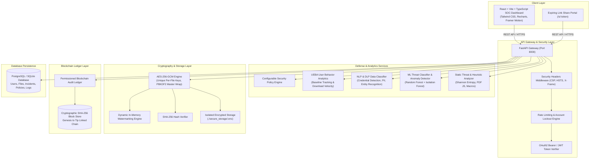
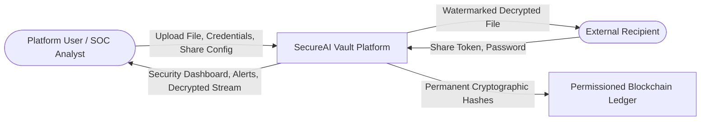
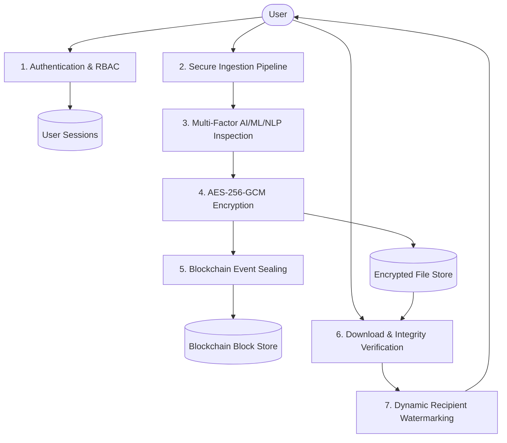
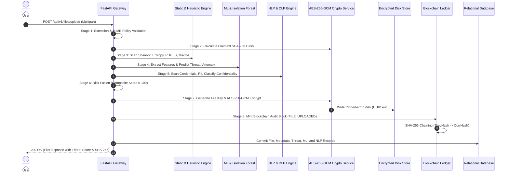
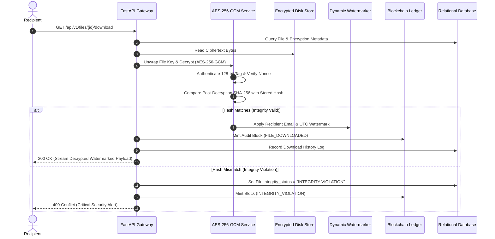
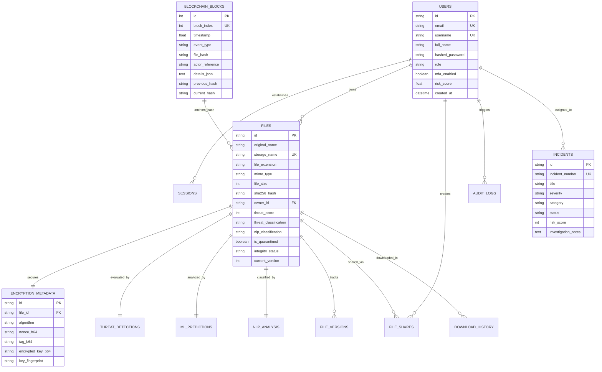

# SecureAI Vault – Enterprise Architecture Document
> **Tagline:** *Protect. Detect. Trust.*

---

## 1. System Architecture Overview

---

## 2. Data Flow Diagrams (DFD)

### DFD Level 0 (Context Diagram)

### DFD Level 1 (Macro Subsystems)

---

## 3. Sequence Diagrams

### Sequence 1: 8-Stage Secure File Upload Pipeline

### Sequence 2: Cryptographic Decryption, Verification & Watermarking

---

## 4. Entity Relationship (ER) Diagram

